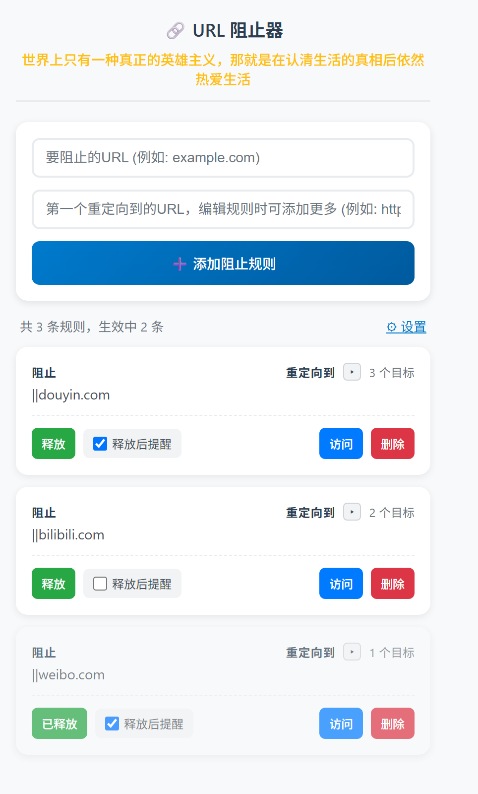

<div align="center">
  

# URL Blocker · 自律拦截器

**把抖音、哔哩哔哩、微博这些「时间黑洞」挡在门外，并把它们重定向到你亲手写下的那个目标页面。**

[](#安装)
[](LICENSE)
[](../../releases/latest)
[](#安装)

</div>



---

## 这是什么

一个 Chrome / Edge 浏览器扩展（Manifest V3）：

> **访问你指定的「分心网站」时，自动拦下这次导航，并随机跳转到你预设的其中一个目标网址。**

它不做内容过滤，也不分析你在看什么。它只做一件很简单的事 ——
**在你决定要自律的那一刻，替未来那个意志力耗尽的你，执行一次导航层面的拦截。**

---

## 设计初衷

刷短视频最狡猾的地方在于，它不需要你同意。你只是「打开看一眼」，二十分钟就没了。

靠意志力去对抗推荐算法，赢面很小 —— 因为那个决定，总是发生在你最累、意志力最薄的一刻。
这个插件的思路是**把决策提前**：在你清醒、精神饱满的时候写下「我不去这些地方」，
然后让浏览器去执行。你不必每次都赢，你只需要写好一次规则。

另一个关键点是**重定向到哪里**。
单纯的报错页或空白页只会让人烦躁地关掉插件；但如果把一个分心网站重定向到
**你真正想抵达的地方** —— 目标院校的官网、想读的书、正在学的课程、自己写的励志页 ——
那么这次「失败的访问」就有机会变成一次有用的访问。

所以它有三重机制：

| # | 机制 | 作用 |
| :-: | --- | --- |
| 1 | **拦截** | 域名级匹配，拦截发生在导航发起之前 |
| 2 | **随机重定向** | 同一个站点配多个目标，每次随机挑一个，避免审美疲劳后失效 |
| 3 | **释放** | 留一个软开关：想访问必须先「解除拦截」，把冲动变成一次主动操作 |

> 说句实话：任何跑在你电脑上的工具，都是可以被绕过的。
> 这个插件不追求「锁死」，它追求的是**增加摩擦** —— 让「顺手刷一下」变成「我得先去设置里关掉它」。
> 大多数时候，这一点延迟就够了。

---

## 核心特性

| 特性 | 说明 |
| --- | --- |
| 🚫 **导航前拦截** | 通过 `webNavigation.onBeforeNavigate` 在页面跳转发起前拦截，主框架导航不会真正加载 |
| 🎲 **一对多随机重定向** | 一条阻止规则可配置多个目标网址，每次访问随机命中一个 |
| 🧩 **灵活的匹配语法** | 支持域名锚点 `\|\|douyin.com`、前缀 `\|https://`、后缀 `\|`、通配符 `*` 与子串包含 |
| ✏️ **可视化增删改** | 点规则卡片即可就地编辑，随时增删重定向目标 |
| 🔓 **一键释放 / 恢复** | 临时放行某个站点，界面上清晰标灰，随时可收回 |
| 👁️ **目标默认收起** | 规则卡片默认只显示重定向目标数量，点 `▸` 才展开完整目标列表 |
| ⏰ **释放后提醒** | 为规则开启提醒后，释放状态下按设定间隔在页面弹出提示，防止过度使用 |
| ⚙️ **提醒间隔设置** | 在主面板弹窗内自定义提醒间隔（默认 15 分钟） |
| 📣 **励志语录** | 面板顶部每次打开随机显示一条激励语，并随机换色 |
| 💾 **纯本地存储** | 规则只存在 `chrome.storage.local`，不联网、不上传、无需登录 |
| 🪶 **零依赖** | 纯原生 JS + HTML，无构建步骤、无第三方库 |
| ↩️ **格式兼容** | 自动兼容旧版单目标规则（`redirectUrl` → `redirectUrls`） |

---

## 安装

### 方式一：下载 Release（推荐）

1. 前往 [Releases](../../releases/latest) 下载 `url-blocker-v1.6.zip`
2. 解压到一个**不会被误删的固定目录**（例如 `D:\Extensions\UrlBlocker`）
3. 打开浏览器，地址栏输入 `chrome://extensions`（Edge 为 `edge://extensions`）
4. 打开右上角的 **开发者模式**
5. 点击 **加载已解压的扩展程序**，选择第 2 步解压出的文件夹
6. 工具栏出现插件图标，安装完成 ✅

### 方式二：克隆源码

```bash
git clone https://github.com/AIRUIMAX/UrlBlocker.git
cd UrlBlocker
```

然后按上面的第 3～5 步，把仓库目录作为「已解压的扩展程序」加载即可。

> **提示**：请使用「加载已解压的扩展程序」而不是把 `.crx` 拖进浏览器 —— 后者会被 Chrome 拦截。
> 加载后建议在扩展详情里勾选「在无痕模式下启用」，避免用无痕窗口绕过。

---

## 使用指南

### 1. 添加一条阻止规则

| 输入框 | 填写内容 | 示例 |
| --- | --- | --- |
| 要阻止的 URL | 匹配表达式 | `\|\|douyin.com` |
| 第一个重定向到的 URL | 目标地址，无协议会自动补 `https://` | `https://www.zhihu.com/` |

点击 **➕ 添加阻止规则** 即生效，无需重载扩展。

### 2. 给同一个站点加更多重定向目标

点击规则卡片进入编辑模式 → **➕ 添加重定向 URL** → 保存。
添加第二个目标后，每次访问该站点都会在这几个目标之间**随机**跳转。

卡片上的 **重定向到** 默认只显示目标数量（如「3 个目标」），点击旁边的 `▸` 展开箭头即可查看完整的目标列表，再次点击收起。

### 3. 释放 / 收回某个站点

点 **释放** 按钮即可临时放行该站点，卡片会变灰显示「已释放」；
再点一次 **已释放** 收回到拦截状态。

### 4. 开启“释放后提醒”

在规则卡片中勾选 **释放后提醒**。该规则被释放后，后台会按设置间隔（默认 15 分钟）在匹配页面弹出提示：

> 你已经使用了 15 分钟，是否重新拦截该 URL？

* 选择 **是，重新拦截** —— 立即收回放行，并将当前标签页重定向到目标网址
* 选择 **不，继续使用** —— 保留放行状态，间隔时间到后再次提醒

点击主面板右上角的 **⚙ 设置**，在弹出的设置窗口中调整全局提醒间隔（1~1440 分钟）。

### 4. 删除 / 修改

* 点卡片正文 → 就地编辑
* 点 **删除** → 移除规则
* 点 **访问** → 无视拦截，主动打开被阻止的网址（用于确认链接是否有效）

---

## 匹配语法

匹配表达式会被统一转成小写后比较（**大小写不敏感**）。

| 写法 | 类型 | 匹配效果 |
| --- | --- | --- |
| `\|\|douyin.com` | 域名锚点 | 命中 `douyin.com` 及其所有子域（`www.` / `live.` / `m.` 等），**推荐日常使用** |
| `\|\|bilibili.com` | 域名锚点 | 同上 |
| `\|https://example.com` | 开头锚点 | URL 以该字符串开头 |
| `example.com/feed\|` | 结尾锚点 | URL 以该字符串结尾 |
| `*://*.weibo.com/*` | 通配符 | `*` 展开为任意字符，按整串正则匹配 |
| `douyin` | 子串包含 | URL 中只要出现 `douyin` 就命中（最宽松，慎用） |

**优先级**：按规则列表自上而下匹配，**命中第一条即停止**，后续规则不再参与。

---

## 推荐的重定向目标

把拦截变成一次「有用的替代」，比单纯拦住有效得多。可以试试：

* 📚 **你的目标院校 / 专业官网** —— 提醒自己为什么在学
* 🎓 **正在学的课程** —— Coursera / 中国大学 MOOC / 某个技术文档
* 📖 **在读的书 / 读书笔记** —— 你自己的 Obsidian 库、Notion 页面
* ⌨️ **GitHub / 项目仓库** —— 把手上的项目往前推一步
* 🌱 **自建励志页** —— 一张自己写的 HTML，放上目标与理由，作为本机默认跳转页

---

## 工作原理

```text
用户在地址栏输入 / 点击链接
        │
        ▼
chrome.webNavigation.onBeforeNavigate   ← 导航发起前触发（仅主框架 frameId === 0）
        │
        ▼
读取 chrome.storage.local['urlBlockingRules']
        │
        ├─ 跳过 released: true 的规则
        ├─ 用 urlMatchesFilter() 逐条匹配当前 URL
        │
        ▼ 命中第一条
在 redirectUrls 中「随机」选一个有效目标
        │
        ▼
chrome.tabs.update(tabId, { url: 目标地址 })   ← 重定向完成
```

**为什么不用 `declarativeNetRequest` 直接做重定向？**
因为 DNR 的 `redirect` 动作要求目标是**固定 URL**，无法表达「多个目标里随机挑一个」。
所以拦截判断放在 Service Worker 里完成，重定向交给 `chrome.tabs.update`。
`declarativeNetRequest` 权限仅保留用于清理早期版本留下的动态规则，避免残留规则造成二次跳转。

### 存储结构

规则保存在 `chrome.storage.local` 的 `urlBlockingRules` 键下：

```json
[
  {
    "url": "||douyin.com",
    "redirectUrls": [
      "https://www.zhihu.com/",
      "https://www.coursera.org/",
      "https://github.com/"
    ],
    "released": false
  },
  {
    "url": "||weibo.com",
    "redirectUrls": ["https://github.com/"],
    "released": true
  }
]
```

| 字段 | 类型 | 说明 |
| --- | --- | --- |
| `url` | `string` | 匹配表达式 |
| `redirectUrls` | `string[]` | 随机重定向目标列表，至少一个 |
| `released` | `boolean` | `true` 表示临时放行，不参与拦截 |
| `reminderEnabled` | `boolean` | `true` 表示释放后按间隔弹出提醒 |

> 旧版本的 `redirectUrl`（字符串）字段会在读取时自动转换为 `redirectUrls` 数组，历史配置不会丢失。

---

## 项目结构

```text
UrlBlocker/
├─ manifest.json          # Manifest V3 清单：权限、图标、入口
├─ background.js          # Service Worker：URL 匹配 + 随机重定向 + 提醒调度
├─ content.js             # 内容脚本：在页面上显示释放后提醒弹窗
├─ popup.html / popup.js  # 弹窗界面：规则增删改、语录、释放开关、提醒开关、设置弹窗
├─ test.html              # 本地拦截功能自测页
├─ assets/                # 扩展图标 16 / 36 / 48 / 128
└─ docs/screenshots/      # README 配图
```

---

## 权限说明

本扩展申请的每一项权限都对应明确的用途，全部在本地完成，不涉及任何远程请求：

| 权限 | 用途 |
| --- | --- |
| `storage` | 在本机保存你的阻止规则 |
| `webNavigation` | 在导航发起前获知即将访问的 URL |
| `tabs` | 把当前标签页重定向到目标网址 |
| `alarms` | 在后台按设定间隔触发释放后提醒 |
| `declarativeNetRequest`<br>`declarativeNetRequestWithHostAccess` | 清理旧版本遗留的动态规则 |
| `host_permissions: <all_urls>` | 被阻止的站点无法预先枚举，需要匹配任意站点 |
| `content_scripts` | 在目标页面注入释放后提醒弹窗 |

---

## 常见问题

<details>
<summary><b>访问被阻止的网站时，会先闪一下原页面吗？</b></summary>

正常情况不会。拦截发生在 `onBeforeNavigate`，也就是导航**发起之前**，此时原页面还没有开始加载。
只有在极端网络条件下（例如系统卡顿导致回调延迟）才可能出现极短暂的闪现。
</details>

<details>
<summary><b>为什么重定向目标要随机，而不是固定一个？</b></summary>

固定目标看几天就会变成新的「背景板」——你会在那个页面上继续发呆。
多个目标随机命中，能让每次拦截都保留一点「意外」，降低适应速度。
</details>

<details>
<summary><b>规则会被上传到服务器吗？</b></summary>

不会。扩展不包含任何网络请求代码，规则仅保存在浏览器的本地存储中。详见 [PRIVACY.md](PRIVACY.md)。
</details>

<details>
<summary><b>能防住「用无痕窗口绕过」吗？</b></summary>

在 `chrome://extensions` 的扩展详情页中开启 **「在无痕模式下启用」**，无痕窗口同样会被拦截。
但请注意，任何本地工具都无法阻止你自己手动关掉它 —— 这正是下一题。
</details>

<details>
<summary><b>我随手就能关掉扩展，那它有什么用？</b></summary>

它拦不住铁了心的你，它拦的是「顺手」的那一下。
从「点开抖音」到「点开抖音 → 发现被拦 → 进设置页 → 关闭扩展 → 再点开抖音」，
中间多了好几步，也多了好几次反悔的机会。绝大多数冲动，熬不过这十几秒。
</details>

<details>
<summary><b>我只想拦住，不想跳转，可以吗？</b></summary>

目前 `redirectUrls` 必须至少填写一个有效目标才会生效。
如果只想「拦住」，建议把目标设为一个本地自建的空白/励志页面。
</details>

---

## 已知限制

* **只拦截主框架**：`frameId !== 0` 的 iframe 导航不处理（嵌入式播放器内部跳转不受影响）
* **站内单页路由不触发**：SPA 内部 `history.pushState` 不产生导航事件；但由于入口域名已被拦截，实际影响很小
* **单条命中**：同一 URL 只应用第一条命中的规则
* **可被手动绕过**：见上方 FAQ —— 这是定位使然，不是缺陷
* **仅限 Chromium 系**：Firefox 需额外适配 `browser.*` 命名空间

---

## Roadmap

- [x] **释放后提醒**：规则释放后按间隔提醒，避免「临时放行」变成「无限放纵」
- [ ] **拦截计数**：记录「今天它替你挡下了多少次」，可视化自律进度
- [ ] **冷却机制**：连续尝试 N 次后强制锁定一段时间，进一步抬高摩擦
- [ ] **分时段策略**：工作/学习时段严格拦截，休息时段自动放宽
- [ ] **导入 / 导出**：规则 JSON 一键备份与迁移
- [ ] **权重随机**：为目标网址设置出现概率，而不只是等概率抽取
- [ ] **内置拦截页**：本地渲染一页励志语录，替代「必须有跳转目标」的限制

> 有想法欢迎开 [Issue](../../issues) 或 PR。

---

## 免责声明

本扩展是一个**自我约束辅助工具**，用于按使用者自身的意愿屏蔽特定网站。
请仅将其用于管理**你自己的**浏览器行为，不要用于监控、限制他人设备或绕过任何平台的合法访问控制。
因使用本工具产生的任何后果由使用者自行承担。

---

## License

[MIT](LICENSE) © 2026 AIRUIMAX

<div align="center">
<sub>自律不是把自己逼到极限，而是把环境调成不需要意志力的样子。</sub>
</div>
